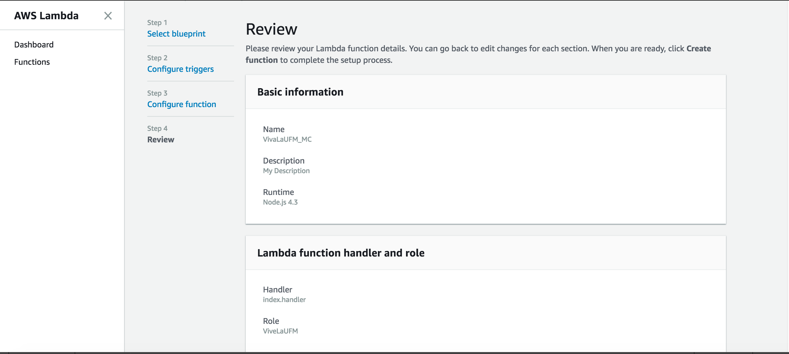

[back](../README.md)

# 0. Go to Lambda 

> Services >> Lambda 

 

# 1. Create Lambda Function 
 

# 2. Author from scratch
 

# 3. Fill in basic information
**NOTE:** Please Fill in with your name Initials and your year of birth:

`Examples`:
- Carlos Perez 1995 => CP95
- Maria Galvez 1997 => MG97

 

# 4. Assign handler role
> Choose ViveLaUFM role

 

# 5. Configure Triggers (next)
> Click Next
 

# 6. Copy paste main.js into "inline code"
 

# 7. Review Information (compare it)
 

[back](../README.md)
