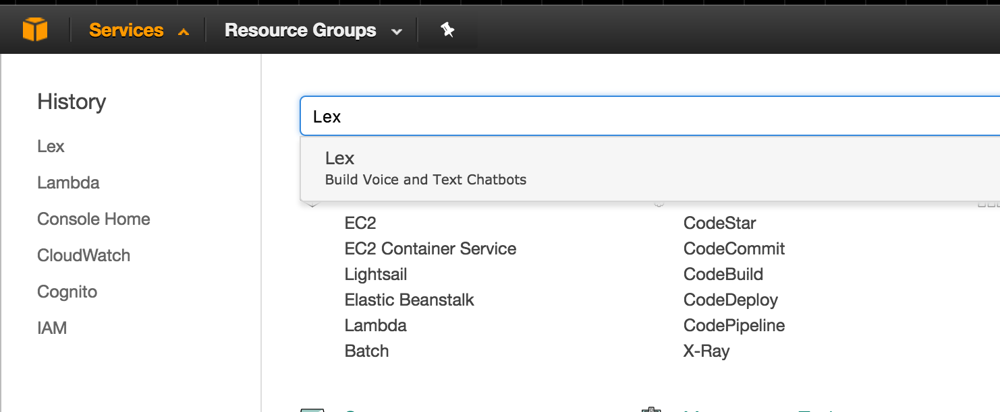
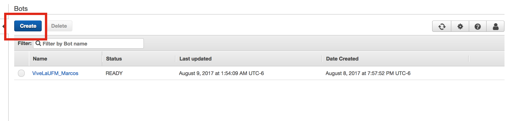
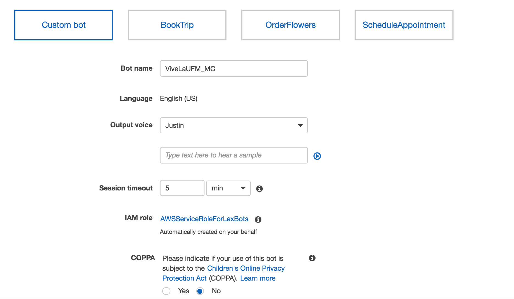
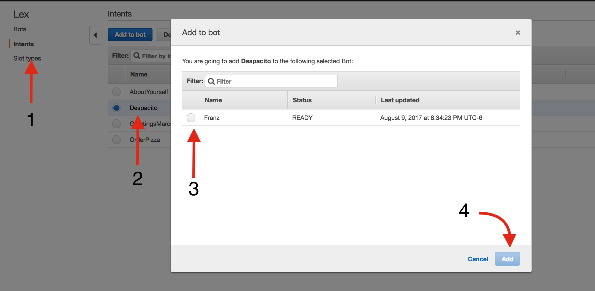
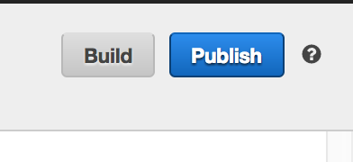
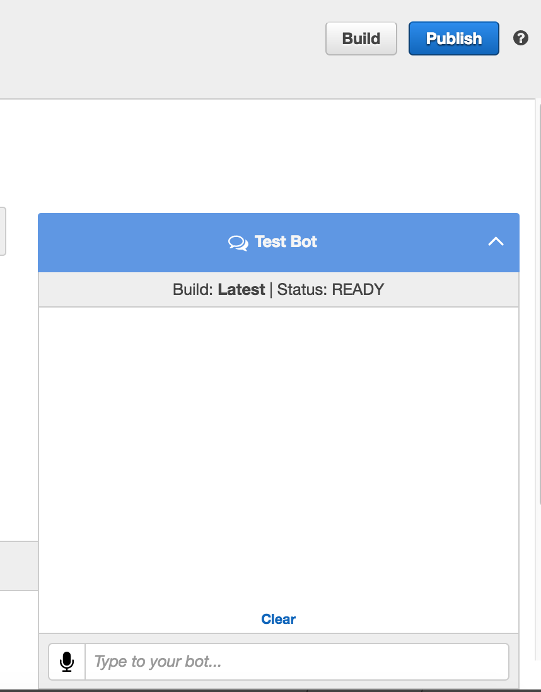

[back](../README.md)

# 0. Go to Lex 

> Services >> Lex 

 

# 1. Create new Lex bot
 

# 2. Create a Custom Bot 
 

- `Bot name:` VivaLaUFM_Initials
- `Output voice:` Justin
- `Session Timeout:` 5 min
- `COPPA:` No

# 3. Add existing intent into new bot

 

> Lex Home >> Intents >> Despacito >> Add to Bot >> Select YOUR bot >>  ADD

# 4. Build your bot
> Go back to your bot's home : Lex Home >> Bots >> Select YOUR bot >> BUILD
 

# 5. Play with your bot
 

> insert "sing"

[back](../README.md)
